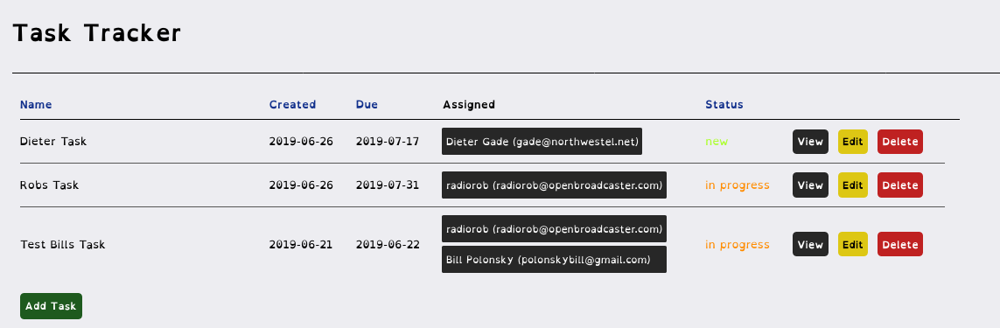

 

{: .Task Tracker}

# Task Tracker 
{:.no_toc}

* TOC
{:toc}

Assign users and groups to tasks

Assign Media and Play Lists tasks to users and groups.

Review notes from users on tasks

Sort Tasks by `New`, `In Progress` and `Complete`

`Compensate Users`, pay per media or play lists item when tasks are `Complete` with 
__Payments module__
